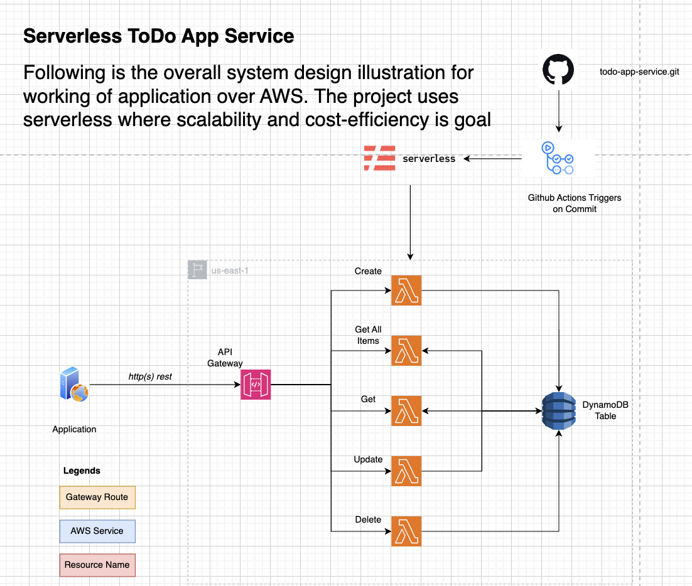

# Serverless Todo App Service

This project is a **Serverless** implementation of a **CRUD** (Create, Read, Update, Delete) application using **AWS Lambda**, **API Gateway**, and **DynamoDB**. The application is designed as an example todo app to perform basic CRUD operations while leveraging the scalability and cost-efficiency of serverless architecture.

---

## Table of Contents

- [System Architecture](#system-architecture)
- [Features](#features)
- [Tech Stack](#tech-stack)
- [Installation](#installation)
- [Configuration](#configuration)
- [Testing](#testing)
- [Usage](#usage)
- [License](#license)

---

## System Architecture

The system is built on a serverless architecture to ensure scalability, flexibility, and cost-effectiveness. Below is an overview of the system architecture:

- **API Gateway**: Serves as the HTTP entry point for all requests, routing them to the appropriate Lambda functions.
- **AWS Lambda**: Contains the business logic to perform CRUD operations on DynamoDB.
- **DynamoDB**: A fully managed NoSQL database that stores item records for the CRUD operations.
- **GitHub Actions**: Manages the CI/CD pipeline, ensuring seamless integration and delivery.

### System Architecture Diagram

[](./system-architecture.png)

---

## Features

- **Create**: Add new items to DynamoDB.
- **Read**: Fetch items by ID or list all items.
- **Update**: Modify existing items.
- **Delete**: Remove items by ID.
- **Scalable**: Built on AWS Lambda and DynamoDB for automatic scaling.
- **Cost-effective**: Pay-per-use model enabled through serverless architecture.

---

## Tech Stack

- **AWS Lambda**: Serverless compute service.
- **API Gateway**: To expose HTTP endpoints for the application.
- **DynamoDB**: NoSQL database for storing items.
- **Node.js**: Backend programming language for Lambda functions.
- **Jest**: Unit testing framework for Node.js.
- **GitHub Actions**: CI/CD pipeline for automated testing and deployment.

---

## Installation

To set up the project locally, follow these steps:

### Prerequisites

- **Node.js** (Latest version)
- **Serverless Framework** installed globally:
  ```bash
  npm install -g serverless
  ```
- **AWS CLI** installed and configured.

### Steps

1. Clone the repository:
   ```
   https://github.com/megha54/Serverless-Todo-App-Service.git
   ```

2. Navigate to the project directory:
   ```
   cd todo-app-service
   ```

3. Install the dependencies:
   ```
   npm install
   ```

4. Deploy the project to AWS:
   ```
   serverless deploy
   ```

---

## Configuration

The project uses environment variables to configure the DynamoDB table name, and AWS resources. Configuration is handled via the `serverless.yml` file.

### Environment Variables

Make sure to configure the following environment variables in your `serverless.yml`:

- **DYNAMODB_TABLE**: The name of the DynamoDB table.
- **AWS_REGION**: The AWS region to deploy to (default: `us-east-1`).

### serverless.yml

```yaml
provider:
  name: aws
  runtime: nodejs14.x
  region: us-east-1
  environment:
    DYNAMODB_TABLE: ${self:custom.tableName.${self:provider.stage}}
  ...
```

---

## Testing

This project uses **Jest** for unit testing. To run the test suite:

1. Install testing dependencies:
   ```
   npm install --save-dev jest
   ```

2. Run the tests:
   ```
   npm test
   ```

Test cases cover all CRUD operations, including **create**, **get**, **list**, **update**, and **delete**.

---

### GitHub Actions Workflow

This project uses **GitHub Actions** for Continuous Integration and Continuous Deployment (CI/CD). The pipeline automatically runs the following steps on each push to the `dev`, `staging`, `prod` branch:

- **Unit Testing**: Runs the Jest test suite to ensure all business logic works as expected.
- **Deployment**: Automatically deploys the serverless application to AWS after successful tests.

Make sure to have environment with name `ci_cd_pipeline` in Secrets and Variables.
Inside it add your AWS Credentials with following secrete name : `AWS_ACCESS_KEY_ID`, `AWS_SECRET_ACCESS_KEY`.

#### NOTE: for the sake of simplicity we are using same environment creation in secrets but in production usage we should have keys configured for different branches with respective branch name as environment name.

### How to Use the GitHub Actions Pipeline

1. Ensure your repository contains a `.github/workflows/node.js.yml` file configured for your pipeline.
2. On every push, GitHub Actions will:
   - Install dependencies
   - Run tests
   - Deploy to the AWS environment if all checks pass.

---

## Usage

After deploying the application, you can interact with the CRUD operations via the API Gateway endpoints. Below are the example API endpoints:

- **Create an Item (POST)**: `/dev/items`
- **Get an Item (GET)**: `/dev/items/{id}`
- **List Items (GET)**: `/dev/items`
- **Update an Item (PUT)**: `/dev/items/{id}`
- **Delete an Item (DELETE)**: `/dev/items/{id}`

### Example Curl Request

```
curl -X POST https://your-api-id.execute-api.region.amazonaws.com/dev/items \\
     -H "Content-Type: application/json" \\
     -d '{"name":"Item 1", "description":"Item description"}'
```

## License

This project is licensed under the MIT License - see the [LICENSE](LICENSE) file for details.
